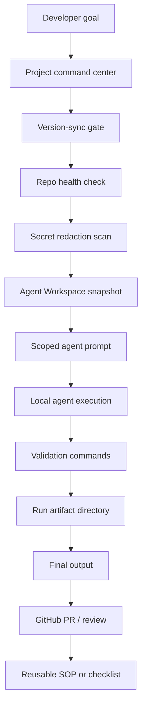

# Portfolio Overview

This document is the fast-read portfolio entry for `ai-devos-kit`.

## One-line value

A local-first operating kit for AI-assisted development that turns ad hoc agent usage into repeatable, auditable, repository-safe workflows.

## What problem it solves

AI coding agents are effective only when the surrounding workflow is disciplined. Without a control plane, agent work tends to suffer from stale prompts, unverified repo state, oversized context, unclear stop conditions, scattered validation evidence, and fragile handoffs between tools.

AI DevOS Kit packages the missing operating layer: templates, scripts, prompts, run artifacts, command centers, and validation gates.

## Architecture map



## Core surfaces

| Surface | Purpose | Why it matters |
|---|---|---|
| `templates/global/` | Shared agent rules | Keeps behavior consistent across Codex, Claude Code, Gemini CLI, and Agy |
| `templates/project/` | Project-local setup | Installs repeatable docs, scripts, and command centers |
| `scripts/repo_health_check.sh` | Preflight verification | Prevents work from starting on wrong or dirty repo state |
| `scripts/secret_redacted_scan.sh` | Safety gate | Reduces risk of leaking local/private material into prompts or docs |
| `scripts/agent_workspace_snapshot.sh` | Context compaction | Gives agents a bounded searchable workspace before opening large files |
| `scripts/agent_run_init.sh` | Run artifact setup | Makes each agent run auditable after completion |
| `prompts/` | Handoff templates | Standardizes cross-agent work requests and review requests |
| `docs/` | SOP library | Captures reusable App Store, TestFlight, IAP, PR review, and security workflows |

## Demo flow

```text
1. Install project kit into a repo.
2. Run repo health and secret checks.
3. Generate Agent Workspace snapshot.
4. Generate next-agent prompt.
5. Execute a bounded task with a local agent.
6. Capture validation evidence in a run artifact.
7. Promote durable findings into docs, AGENTS.md, or PROJECT_COMMAND_CENTER.md.
```

## Portfolio narrative

For recruiters or reviewers, this project demonstrates:

- AI-agent workflow architecture;
- local-first automation design;
- repo-state verification discipline;
- safety gates for private data and secrets;
- reusable prompt and SOP engineering;
- App Store / TestFlight / GitHub PR process thinking;
- practical multi-agent orchestration without pretending agents share one runtime.

## Screenshot policy

This repository is mostly CLI, template, and documentation workflow. A real screenshot is less useful than a run artifact. Portfolio screenshots should therefore show synthetic terminal output, generated `.agent/` artifact layout, or a redacted PR review flow.

Do not commit private local paths, tokens, environment files, certificates, provisioning profiles, Apple account material, banking data, or identity documents as screenshots or sample artifacts.
